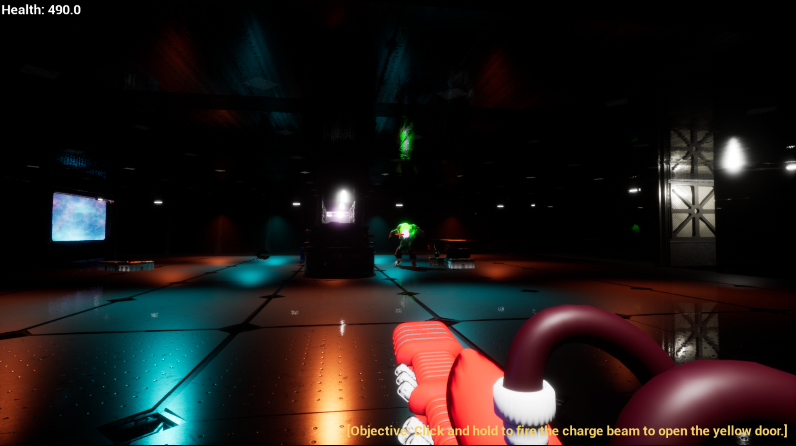

# Space FPS

This is a tech demo developed with Unreal Engine 4 meant to practice Tech Art Concepts, such as LODs, HLODs, Level Streaming, and Material Optimizations. These concepts are put to use in a small Metroidvania first person shooter with an original soundtrack.

## Controls
- WASD - Movement
- Mouse - Look Around
- LMB - Fire
- Hold LMB - Charge Beam (When Unlocked)
- Space - Jump (When Unlocked)
- Mouse Wheel - Switch weapons (When Unlocked)
- Escape or P - Pause

## Asset Packs Used
Various asset packs are used in this project and have been optimized.
- [Modular Scifi Season 2 Starter Bundle](https://www.unrealengine.com/marketplace/en-US/slug/modular-scifi-season-2-starter-bundle)
- [Paragon: Minions](https://www.unrealengine.com/marketplace/en-US/slug/paragon-minions)
- [Procedural Nature Pack Vol.1](https://www.unrealengine.com/marketplace/en-US/slug/procedural-nature-pack-vol)
- [FPS Weapon Bundle](https://www.unrealengine.com/marketplace/en-US/slug/fps-weapon-bundle)
- [Energy Rifle](https://www.turbosquid.com/3d-models/laser-rifle-energy-blend-free/699887)
- [Missile](https://www.turbosquid.com/FullPreview/Index.cfm/ID/309350)

## Testing out the project
Getting setup with this project locally will require downloading and installing each of these asset packs. If you would just like to play this demo, see the Releases tab.